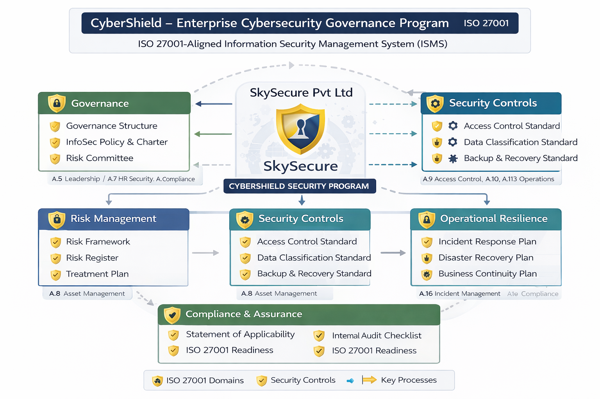

🛡 CyberShield – Enterprise Cybersecurity Governance Program

📌 Overview
## 🏗 CyberShield Architecture

The CyberShield program follows an ISO 27001–aligned Information Security Management System (ISMS) model integrating governance, risk management, security controls, operational resilience, and compliance assurance.

CyberShield is a structured, end-to-end cybersecurity governance and risk management program designed for a simulated mid-sized enterprise (SkySecure Pvt Ltd).

The project demonstrates implementation of an ISO 27001-aligned Information Security Management System (ISMS) using risk-based decision-making and executive-level reporting.

🎯 Program Objectives

Establish cybersecurity governance structure

Implement enterprise risk management framework

Deploy preventive and detective controls

Develop incident response and disaster recovery capability

Enable business continuity planning

Provide executive-level security posture reporting

🏛 Governance & Strategy

Governance Structure

Information Security Policy

Project Charter

Risk Committee Model

📊 Risk Management

ISO-aligned Risk Framework

Enterprise Risk Register

Risk Treatment Plan

Risk Escalation Model

🔐 Security Controls

Access Control Standard

Data Classification & Handling

Backup & Recovery Controls

🚨 Operational Resilience

Incident Response Plan

Disaster Recovery Plan

Business Continuity Plan

🔍 Compliance & Assurance

Statement of Applicability (ISO 27001 mapping)

Internal Audit Checklist

📈 Executive Reporting

KPI/KRI Dashboard

Risk Posture Summary

Board-Level Reporting Framework

🛠 Framework Alignment

ISO/IEC 27001:2022

ISO 31000

CISM Risk Governance

Risk-Based Security Management

👤 Author

Sujit Kumar
Cybersecurity & IT Governance Professional

## Disclaimer

SkySecure Pvt Ltd is a fictional organization created for educational and portfolio purposes as part of the CyberShield cybersecurity governance project.

This repository does not represent a real company, system, or security environment.
